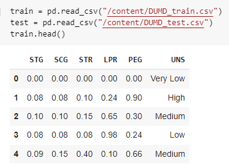

# [User Knowledge Modeling] building One-vs-Rest and One-vs-One strategies using DUMB dataset. 

## Descriptin
In this assignment, we had Data User Modeling Dataset (DUMD). Training and test splits 
are provided in csv file format. Data description:
- STG (The degree of study time for goal object materials), (input value)
- SCG (The degree of repetition number of user for goal object materials) (input 
value)
- STR (The degree of study time of user for related objects with goal object) (input 
value)
- LPR (The exam performance of user for related objects with goal object) (input 
value)
- PEG (The exam performance of user for goal objects) (input value)
- UNS (The knowledge level of user) (target value)
1. Very Low: 50
2. Low:129
3. Middle: 122
4. High 130
- We made 3 different techniques to predict the output of DUMDs:
1. First: we used multi classes using 2 different models (“SVM” and “Perceptron”).
2. Second: we used One versus Rest (OvR).
3. Third: we used One Versus One (OvO).

   
# Problems 
- Load the DUMD dataset 
- convert categorical class labels under the ”UNS” column to numerical values by using the Label Encoder. 
- Choose two features from DUMD dataset to apply SVM and Perceptron algorithms 
for classification.
- Plot the data by showing classes separately. 
- Classify testing data by using SVM and Perceptron classifiers.- Provide accuracies,confusion matrix and decision boundaries for both classifiers. 
- Build OvR-SVM, test on DUMD testing dataset with obtained features from
## Problem 1. 
2.2 For each binary classifier:

• Obtain the binarized labels (OvR) 

• Obtain the SVM’s accuracy 

• Plot SVM’s decision boundary

2.3 Use argmax to aggregate confidence scores and obtain the final predicted labels and obtain the performance (i.e.confusion matrix, accuracy, plotting correct and wrong prediction points) of OvR-SVM. You can check MBC Simple Data

3.1 Build OvO-SVM, test on DUMD testing dataset with obtained features from
## Problem 2.
3.2 For each binary classifier:

• Obtain the binarized labels (OvO) 

• Obtain the SVM’s accuracy 

• Plot SVM’s decision boundary 

3.3 Use argmax to aggregate confidence scores and obtain the final label and obtain
the performance (i.e., confusion matrix, accuracy, plotting correct and wrong
prediction points) of OvO-SVM. 
   
  #  Conclusion:
First, we learned we need to transform labels into numbers using a label encoder because 
the model doesn’t work with characters. Second, in multiclass, we learned SVM model 
has the capability to distinguish between multi classes than perceptron. Third, we 
learned how to draw a decision boundary. After that, we learned how to construct one 
versus one and one versus rest from scratch, what the difference between them, and the 
performance of one versus rest is better than one versus one because in one versus one 
we test the model with data that it doesn’t have any similar experience with it. We learned 
we need to binarize the model before we used it one versus rest and one versus one. We 
also learned we need to extract the probability of each class using predict_proba. We also 
learned about the hstack function that is used to combine the probability together, and 
the argmax that is used to extract the highest probability class to compute the accuracy. 
Lastly, we earned how to display the confusion matrix 
